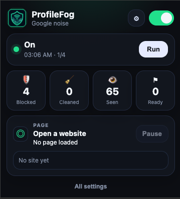
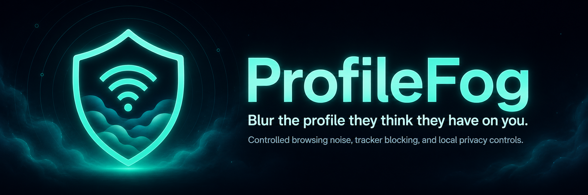

## Screenshot

  

  

# ProfileFog

Ad networks and trackers build profiles by watching patterns. ProfileFog changes the pattern.

## Quick install

1. Download or clone this repository.
2. Open Chrome.
3. Go to `chrome://extensions`.
4. Turn on `Developer mode`.
5. Click `Load unpacked`.
6. Select the `ProfileFog` folder.
7. Click the ProfileFog icon and turn it on.

## Why ProfileFog exists

ProfileFog is built around the idea: make your online profile harder to trust.

Classic tools like AdNauseam and TrackMeNot showed that privacy can also come from obfuscation. AdNauseam popularized ad profile obfuscation by adding noise to advertising surveillance. TrackMeNot hid searches inside a stream of decoy searches. ProfileFog brings that same privacy intuition into a Chrome Manifest V3 extension

## What ProfileFog does

* Adds controlled search and browsing ad poison.
* Blends occasional neutral red herring searches into generated activity
* Blocks common tracker requests with Chrome Manifest V3 rules.
* Cleans tracking tags like campaign IDs from links.
* Learns which tracker domains repeatedly follow you across unrelated sites.
* Gives you current page controls when a site acts weird.
* Lets you pause protection on a site without digging through settings.
* Supports cookie block mode for learned trackers.
* Adds local Chrome privacy controls where Chrome exposes them.
* Lets you export and import your settings and learned tracker data.
* Flags possible CNAME cloaking when first-party subdomains look like tracking endpoints.
* Watches canvas, WebGL, audio, screen, device, locale, and media fingerprinting signals without blocking or spoofing.
* Strips watched page URLs and tracker sample URLs from safe exports by default.
* Stores request diagnostic URLs at site origin level instead of keeping page paths.
* Uses a stronger bundled public suffix map for cleaner domain grouping.

## Why people might want it

* Make weak ad interest profiles less reliable.
* Reduce third party tracking while browsing.
* Clean ugly tracking links automatically.
* See which domains keep showing up across sites.

